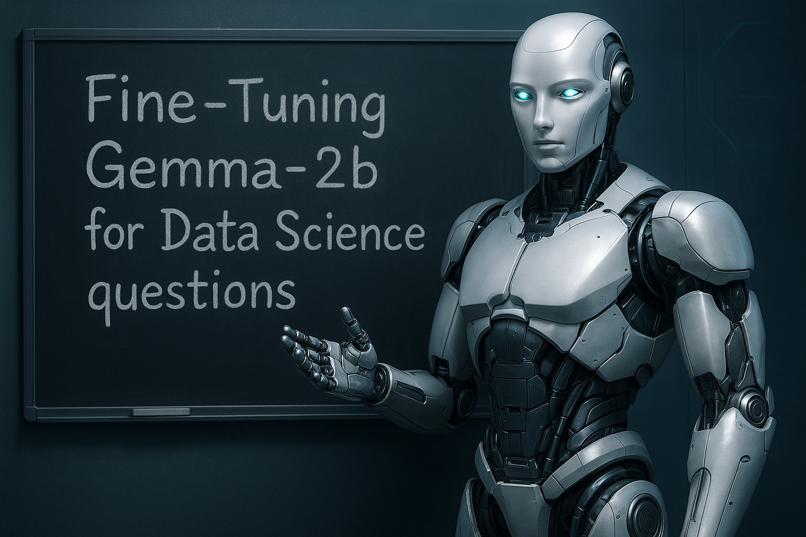

# Fine-Tuning Gemma-2b for Data Science Question Generation

This project details the process of fine-tuning the Gemma-2b language model to specialize in generating high-quality questions related to the fields of Data Science and Machine Learning. The primary goal is to enhance the model's performance on this specific, niche task.

## Project Overview

The core objective of this project is to adapt the general-purpose Gemma-2b model into a specialized tool for creating insightful and relevant questions within the data science domain. This is achieved through supervised fine-tuning on a custom dataset.

## Why Gemma-2b?
The Gemma-2b model was selected for its excellent balance of performance and computational efficiency. Its smaller size, compared to larger models, makes it an ideal candidate for fine-tuning on consumer-grade hardware without significant compromises in its generative capabilities for this specific task.

## Methodology

The fine-tuning process follows these key steps:

- Environment Setup: Installation of all necessary libraries.

- Model Loading: The Gemma-2b model is loaded with 4-bit quantization.

- Data Preparation: A custom dataset is loaded and formatted into a prompt and completion structure.

- PEFT Configuration: LoRA is configured to adapt the model's linear layers.

- Training: The model is trained using the SFTTrainer on the prepared dataset.

- Merging and Saving: The trained LoRA adapters are merged into the base model and saved for inference.

## Training

**All training was done through Google Colab, using a T4 GPU.**

## Dataset

The dataset was generated using the gpt-4o model, which has 5,000 examples of questions related to the area of ​​Data Science and Machine Learning.

## Results

This model is specialized in generating questions about data science and machine learning, demonstrating improved performance and relevance on this task compared to the base model.
